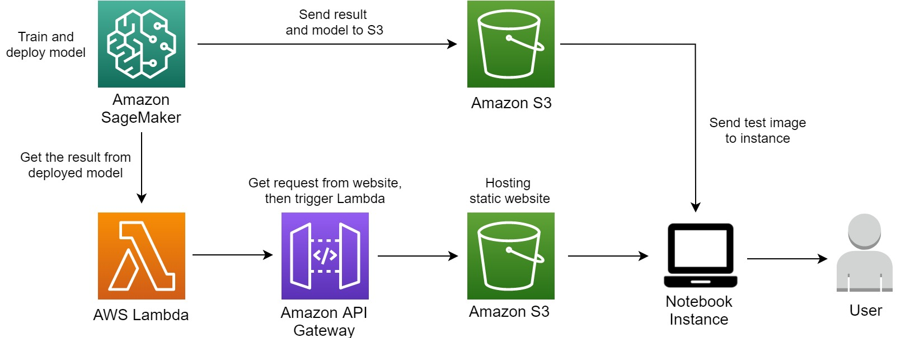
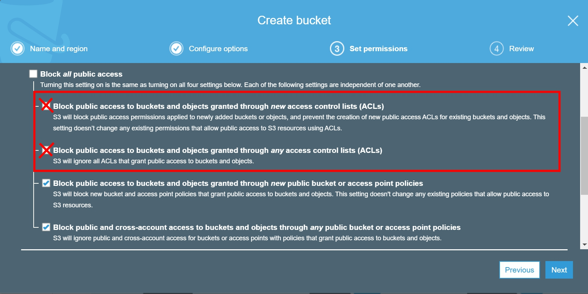
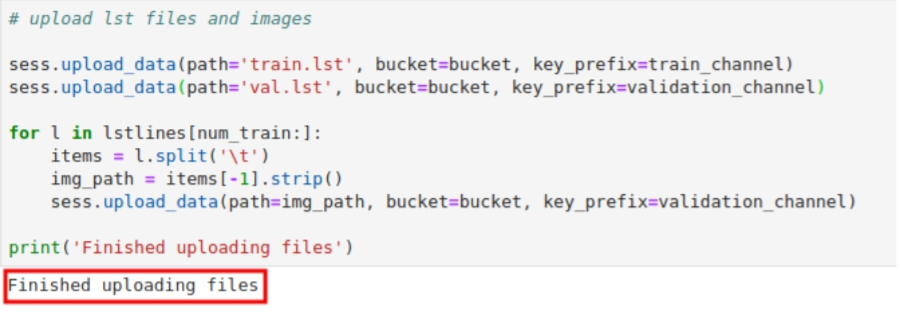
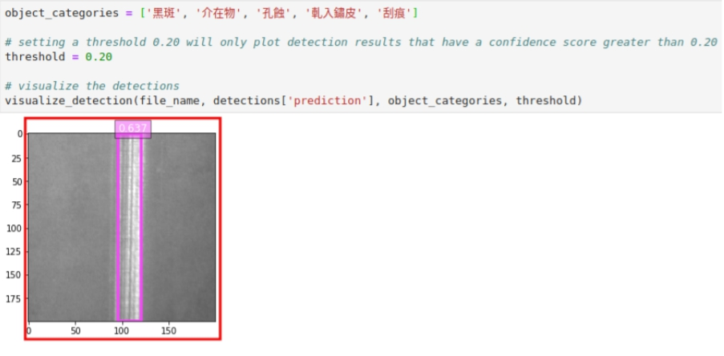
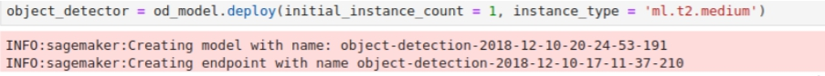
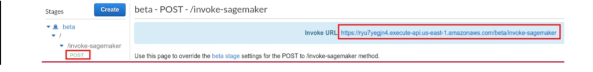
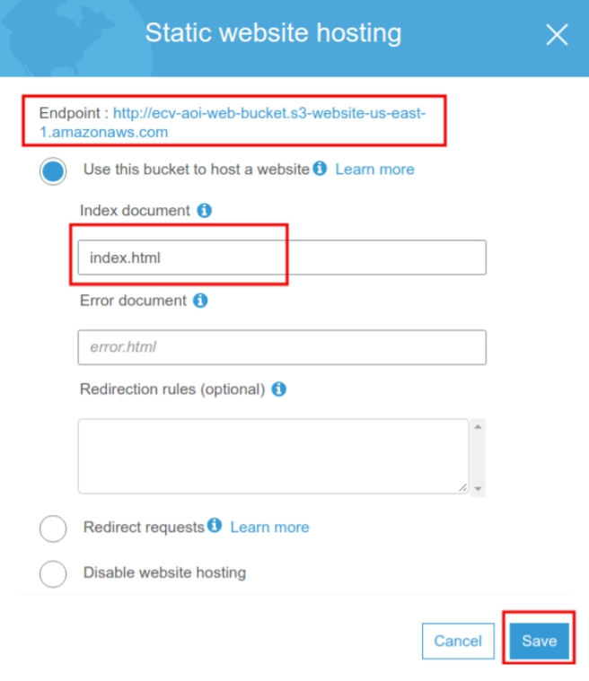
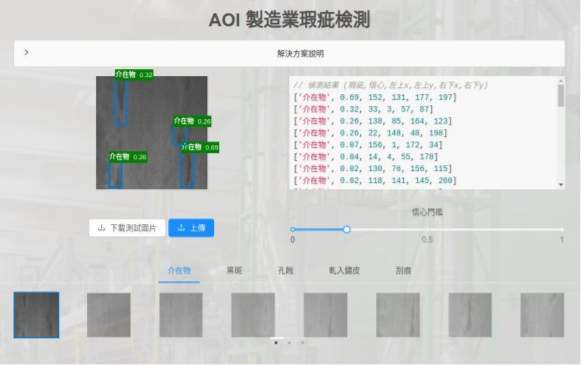

# AOI(Auto Optimistic Inspection) on AWS

**Amazon SageMaker** is a fully managed service that provides every developer and data scientist with the ability to build, train, and deploy machine learning (ML) models quickly. SageMaker removes the heavy lifting from each step of the machine learning process to make it easier to develop high quality models.

## Architecture

<p align = "center">
      
      </p>
    
## Scenario


## Pre-requisites
* An AWS account.
* Make sure the region is **US East (N. Virginia)**, which its short name is **us-east-1**.

## Step-by-step

### Create S3 bucket for storing data and machine learning model

1. On the services menu, select **S3**.

2. Choose **Create Bucket**.

3. For the Bucket Name, type `sagemaker-aoi-firstname(e.g.sagemaker-aoi-jerry)`.

4. At **Set permissions**, uncheck **Block public access to buckets and objects granted through new access control lists (ACLs)**.

5. Also uncheck **Block public access to buckets and objects granted through any access control lists (ACLs)**.

<p align = "center">
      
      </p>

6. Choose **Create bucket**, then select the bucket you just created.

7. Choose **Permissions**, then choose **CORS configuration**.

8. Copy and paste the following setting, then choose **Save**.

```
<?xml version="1.0" encoding="UTF-8"?>
<CORSConfiguration xmlns="http://s3.amazonaws.com/doc/2006-03-01/">
<CORSRule>
<AllowedOrigin>http://*</AllowedOrigin>
<AllowedOrigin>https://*</AllowedOrigin>
<AllowedMethod>POST</AllowedMethod>
<AllowedMethod>GET</AllowedMethod>
<AllowedMethod>PUT</AllowedMethod>
<AllowedMethod>DELETE</AllowedMethod>
<AllowedMethod>HEAD</AllowedMethod>
<ExposeHeader>ETag</ExposeHeader>
<AllowedHeader>*</AllowedHeader>
</CORSRule>
</CORSConfiguration>
```

### Create SageMaker notebook instance

1. On the services menu, select **SageMaker**.

2. Choose **Notebook instances** on the left navigation bar, then choose **Create notebook instance**.

3. Enter and select the following information for your notebook instance:

   - Notebook instance name: **AOINotebookInstance**

   - Instance type: **ml.t2.medium**

   - IAM role: choose **Create a new role**

   - Specific S3 bucket: choose the bucket you just created, e.g. **sagemaker-aoi-jerry**

   - Choose **Create Role**.

4. Choose **Create notebook instance**.

5. Wait for the status of the instance turn into **InService**, then choose **Open JupyterLab**.

### Prepare data by notebook instance

1. After you open your notebook instance, drag the file **aoi_prepare_data.ipynb** into the instance.

2. After you finish upload, double-click to open the file.

3. Search the keyword **bucket = 'sagemaker-aoi-xxx'**, change it into your bucket name, e.g.**sagemaker-aoi-jerry**.

4. Choose **Run**, then choose **Run All Cells**.

5. On the services menu, choose **S3**, choose the bucket you created, then open the folder **DEMO-AOI**.

6. Upload the file contain in **test_images.zip** to the folder **validation**.

7. Check the **validation** folder, choose **Action**, then choose **Make public**.

8. Change the value of **imageSetDownloadURL** to the **S3BucektURL** which locate in **frontend/client/apiConfig.js**.

9. Wait until the upload finish.

<p align = "center">
      
      </p>

### Prepare the machine learning model by notebook instance

1. Make sure the code preparation in last part finished, then open JupyterLab, drag the file **sagemaker/aoi_prepare_model.ipynb** into the instance.

2. After you finish upload, double-click to open the file.

3. Search the keyword **bucket = 'sagemaker-aoi-xxx'**, change it into your bucket name, e.g.**sagemaker-aoi-jerry**.

4. Choose **Run**, then choose **Run All Cells**.

5. The model training will take about **4 hour**, you should see the following image after training is finish.

<p align = "center">
      
      </p>


### Create Lambda function for calling endpoint

1. Change the value of **EndpoingName** in lambda/invokeSagemaker/config.js to the output after the training finish, like the following image.   

<p align = "center">
      
      </p>

2. In lambda/invokeSagemaker/serverless.yml, search for **service** and **region**, and change it as the following:

   - service: **demo-aoi**

   - region: **us-east-1**

3. Open **command line interface** on your local device.

4. Switch the path to **lambda/invokeSagemaker/**

5. Run the following command orderly: 
   - `npm install -g serverless`

   - `npm install`

   - `sls deploy`

6. After you finish running the command, you will see a new Lambda function, it should be named **demo-aoi-dev-invokeSageMaker**. 

7. On the services menu, select **IAM**.

8. Choose **Roles** on the left navigation bar, select **demo-aoi-dev-us-east-1-lambdarole**.

9. Search and select the **AmazonSageMakerFullAccess**, then choose **Attatch policy**.

### Create API Gateway for calling Lambda function

1. On the services menu, select **API Gateway**.

2. Choose **Create New API**, enter `aoi-api` for the name, then choose **Create API**.

3. Choose **Actions**, select **Create Resource**, enter `invokesagemaker` for the name, also check **Enable API Gateway CORS**, then choose **Create Resource**.

4. Select the resource you just created, choose **Actions**, then choose **Create Method**, also select **POST** and tick the checkbox.

5. After **POST - Setup** appears, choose **Lambda Function** for Integration Type, select and enter the following information, then choose **Save**:

   - Lambda Region: **us-east-1**
 
   - Lambda Function: **demo-aoi**

6. Choose **Actions**, then select **Enable CORS and replace existing CORS headers**.

7. Choose **Actions**, then select **Deploy API**; choose **[New Stage]** for Deploy Stage, enter `beta` for stage name, then choose **Deploy**.

8. Choose the stage you just created -> choose method -> POST, get the URL like the following image:

<p align = "center">
      
      </p>

9. Change the value of **getDetectionResult** in frontend/client/apiConfig.js by the **Invoke URL**.


### Create S3 bucket for hosting static website


1. On the services menu, select **S3**.

2. Choose **Create Bucket**.

3. For the Bucket Name, type `website-aoi-firstname(e.g. website-aoi-jerry)`.

4. At **Set permissions**, uncheck **Block public access to buckets and objects granted through new access control lists (ACLs)**.

5. Also uncheck **Block public access to buckets and objects granted through any access control lists (ACLs)**.

<p align = "center">
      
      </p>

6. Choose **Create bucket**, then select the bucket you just created.

7. Choose **Permissions**, then choose **Bucket Policy**.

8. Copy and paste the following setting, then choose **Save**.

```
{
"Version": "2012-10-17",
"Statement": [
 {
 "Sid": "PublicReadGetObject",
 "Effect": "Allow",
 "Principal": "*",
 "Action": "s3:GetObject",
 "Resource": "arn:aws:s3:::[7.3 中所輸入貯體名稱]/*"
 }
]
}
```

9. Choose **Properties**, then select **Static website hosting**, also select the checkbox of **Use this bucket to host a website**.

10. Enter `index.html` for Index document, then choose **Save**.

<p align = "center">
      
      </p>


### Deploy and upload the content of website

1. Open **command line interface** on your local device.

2. Switch the path to **frontend/**

3. Run the following command orderly: 
   
   - npm install
   
   - npm run build:client

4.  After you finish running the command, you will see some new files in **frontend/build/client/**.

5. On the services menu, select **S3**.

6. Choose **Upload**, then upload all the files in **frontend/build/client/**. 
 > Warning: do not upload whole folder, upload the files in the folder!!!

 7. After you finish upload, choose **Properties**, then select **Static website hosting**.

 8. Select the Endpoint URL, like http://website-aoi-xxx.s3-website-us-east-1.amazonaws.com, and you should get into the website, like the following image.

<p align = "center">
      
      </p>

9. Now you can use the website for detecting delect of the interface of iron or steel!

## Conclusion

Congratulations! You have learned how to:

1. Create S3 bucket for storing data and hosting static website

2. Use SageMaker to deploy and train your machine learning model

3. Create lambda function for calling other AWS resourcs

4. Create API Gateway for calling Lambda function

## Clean up

1. S3 bucket

2. Notebook instance/ Training jobs

3. Lambda function

4. API Gateway
